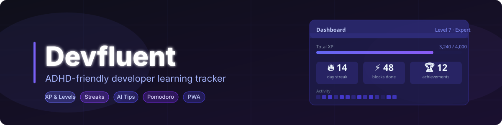
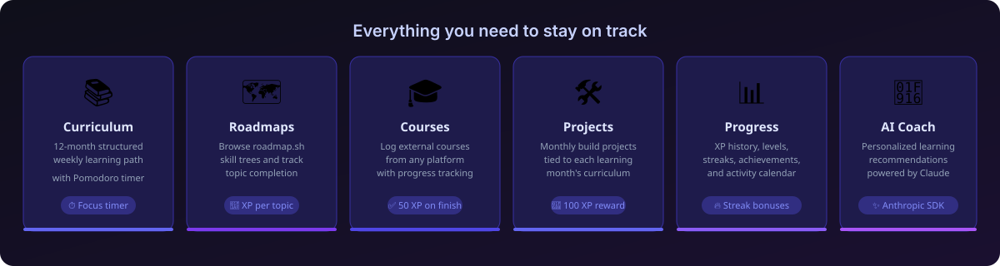
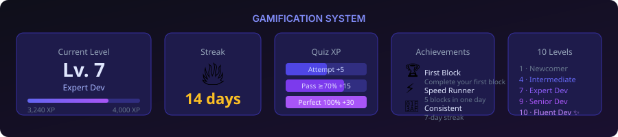

<div align="center">



**Stay focused. Build momentum. Become a developer — on your own terms.**

Devfluent is a gamified learning tracker built for developers with ADHD. It brings together structured curriculum, skill roadmaps, external courses, and monthly projects into one focused system — with XP, levels, streaks, and AI coaching to keep you moving.

[](https://nextjs.org)
[](https://www.typescriptlang.org)
[](https://tailwindcss.com)
[](https://supabase.com)
[](LICENSE)

</div>

---

## Features



### Learning Curriculum
- **12-month structured path** covering JavaScript fundamentals through advanced topics
- Weekly learning blocks organised by type: theory, practice, project, review
- **Pomodoro timer** built into every block — shrinking pie visual, 2-minute transition warning, 4 focus sounds (Web Audio API), automatic XP bonus
- **Knowledge quizzes** with tiered XP rewards (attempt → pass → perfect)
- Practical examples and guided exercises for Month 1 fully populated

### Skill Roadmaps
- Browse and track any roadmap from [roadmap.sh](https://roadmap.sh) directly in the app
- Mark topics and subtopics complete; earn XP for each
- 24-hour API cache with local JSON fallback for offline resilience

### External Courses & Projects
- Log courses from any platform (Udemy, Frontend Masters, YouTube, etc.) with progress tracking
- Monthly build projects tied to your curriculum — complete one for 100 XP
- All tracked in one place alongside your structured curriculum

### Gamification



| Action | XP |
|---|---|
| Complete learning block | 10 |
| Complete block with Pomodoro | 15 |
| Daily login | 5 |
| 7-day streak bonus | 10 |
| 30-day streak bonus | 25 |
| Skip block | 1 |
| Quiz attempt | 3 |
| Quiz pass (≥ 70%) | +12 |
| Quiz perfect (100%) | +25 |
| Complete a course | 50 |
| Complete a project | 100 |
| GitHub push | 5 |
| GitHub PR opened | 10 |
| GitHub PR merged | 20 |

- **10 levels** from Newcomer to Fluent Dev (0 → 18,000 XP)
- **Streak tracking** with consecutive-day bonuses
- **Achievements** — unlockable badges, concurrent-safe with no double-award
- **30-day activity calendar** heatmap

### AI & Integrations
- **AI Coach** — personalized learning recommendations powered by Claude (Anthropic SDK)
- **GitHub sync** — auto-logs pushes, pull requests, and merged contributions as XP; sign in with GitHub to wire it automatically
- **Body-double / accountability mode** — ADHD-specific focus support
- **PWA** — installable on any device, offline-ready with app shortcuts
- **i18n** — English and German interface (cookie-based locale)

---

## Getting Started

### Prerequisites

- Node.js 24+
- A [Supabase](https://supabase.com) project (free tier works)
- A GitHub OAuth app (for GitHub Activity Sync — optional)

### Setup

1. Clone the repo and install dependencies:

```bash
git clone https://github.com/e-pallad/adhs-learning
cd adhs-learning
npm install
```

2. Copy the environment template and fill in your credentials:

```bash
cp .env.production.example .env.local
```

3. Generate the Prisma client:

```bash
npx prisma generate
```

4. Start the dev server:

```bash
npm run dev
```

Open [http://localhost:3000](http://localhost:3000) and sign in with a magic link.

---

## Environment Variables

| Variable | Description |
|---|---|
| `NEXT_PUBLIC_SUPABASE_URL` | Supabase project URL |
| `NEXT_PUBLIC_SUPABASE_ANON_KEY` | Supabase anon/public key |
| `DATABASE_URL` | Pooled connection string (pgbouncer, port 6543) |
| `DIRECT_URL` | Direct connection string (port 5432, used by migrations) |
| `STRIPE_SECRET_KEY` | Stripe secret key for server-side Checkout/webhook calls |
| `STRIPE_WEBHOOK_SECRET` | Stripe webhook signing secret |
| `STRIPE_PRICE_MONTHLY_ID` | Stripe price ID for the monthly Pro plan |
| `STRIPE_PRICE_ANNUAL_ID` | Stripe price ID for the annual Pro plan |
| `ANTHROPIC_API_KEY` | Claude API key for AI recommendations |
| `GITHUB_CLIENT_ID` | GitHub OAuth app client ID (for GitHub Activity Sync) |
| `GITHUB_CLIENT_SECRET` | GitHub OAuth app client secret |
| `NEXT_PUBLIC_APP_URL` | Full app URL, e.g. `https://devfluent.de` (used for OAuth callback) |

---

## Stack

| Layer | Technology |
|---|---|
| Framework | Next.js 16.2 (App Router, Turbopack) |
| Language | TypeScript |
| Styling | Tailwind CSS v4 |
| Database | Supabase PostgreSQL |
| ORM | Prisma 7.6 with `@prisma/adapter-pg` |
| Auth | Supabase magic link (passwordless email OTP) |
| AI | Anthropic Claude SDK |

---

## Project Structure

```
app/
  (auth)/login/         # Magic link login page
  (landing)/            # Public landing page (/)
  (legal)/              # Legal pages (/impressum, /datenschutz)
  (dashboard)/          # All authenticated pages
    dashboard/          # Main dashboard
    learning/           # Curriculum browser + Pomodoro timer
    roadmap/            # Roadmap tracker
    training/           # External courses
    projects/           # Monthly projects
    progress/           # XP history & achievements
    settings/           # Profile & account
  api/
    auth/callback/      # Supabase auth callback
    auth/github/        # GitHub OAuth initiation + callback
    progress/           # block, course, project, roadmap, quiz
    user/               # stats, profile, api-key
    ai/recommendations/ # Claude-powered suggestions
    github/sync/        # GitHub activity ingestion
    accountability/     # Accountability partner linking
  generated/prisma/     # Generated Prisma client (do not edit)
lib/
  prisma.ts             # Prisma client singleton
  supabase/             # Supabase server/client helpers
  xp.ts                 # XP values, level thresholds, achievements
  roadmap.ts            # roadmap.sh API integration
  user.ts               # getCurrentUser, awardXP, updateStreak, checkAchievements
  i18n/                 # Internationalisation (EN/DE dictionaries)
  preferences.ts        # User preference utilities
components/
  ui/                   # card, button, badge, progress-bar
  gamification/         # xp-display, streak-counter, celebration-modal
  learning/             # pomodoro-timer, block-card, month-card
  roadmap/              # roadmap-list, roadmap-node-item
  training/             # course-card, add-course-form
  layout/               # sidebar, top-bar
content/
  curriculum/           # Multi-track curriculum (JavaScript + Python stub)
    tracks/javascript/  # month-01.json … month-12.json
    tracks/python/      # month-01.json (stub)
    index.ts            # Curriculum loader (CURRICULUM, TRACKS, getTrackById)
    types.ts            # Shared TypeScript interfaces
prisma/
  schema.prisma         # Database schema
prisma.config.ts        # Prisma 7 datasource config
proxy.ts                # Auth guard (Next.js 16 — replaces middleware.ts)
```

---

## Contributing

Issues and PRs are welcome. Please open an issue first for larger changes.

---

## License

MIT
